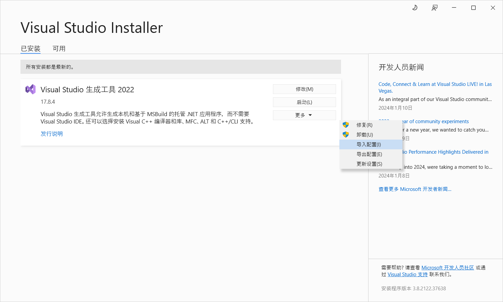
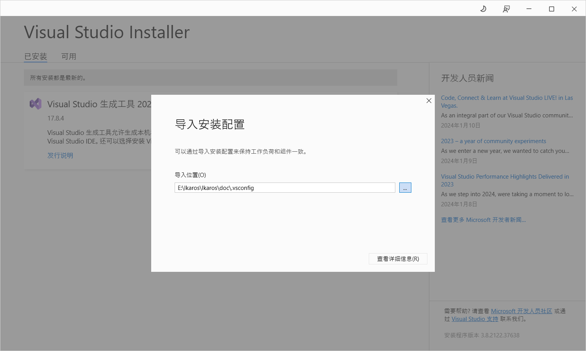
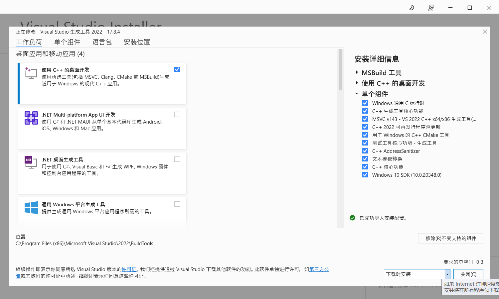

###### https://github.com/lwx-xin/Ikaros.git

### 一：开发准备工作

##### 1.安装软件（doc目录下有安装包）

```
nodejs：v20.10.0
python：3.8.10（编译sqlite3时使用）
vs_buildtools（编译sqlite3时使用）
```

##### 2.安装vs_buildtools插件

###### 步骤1：导入.vsconfig文件



步骤2：导入.vsconfig文件后点击【查看详细信息】



步骤3：安装



##### 3.安装cnpm（不是必须）

```shell
npm install -g cnpm -registry=https://registry.npm.taobao.org
```

##### 4.修改npm镜像仓库

```
修改C:\Users\lu\.npmrc文件，在文件中添加：
registry=https://registry.npm.taobao.org/
ELECTRON_MIRROR=https://cdn.npm.taobao.org/dist/electron/
ELECTRON_BUILDER_BINARIES_MIRROR=http://npm.taobao.org/mirrors/electron-builder-binaries/
```

##### 5.注意点

```
启动项目：npm run electron:dev（或者执行doc/cmd/StartUp.bat）
```


### 二：打包程序（window）

```
1.按下win+W+A打开PowerShell
2.进入项目根目录（package.json同级目录），在根目录按住Shift点击鼠标右键选择【在此处打开PowerShell窗口】可以直接进入项目根目录
3.执行npm run electron:build
4.打包好的安装包在dist_electron目录下，dist_electron/win-unpacked是免安装版本
```


